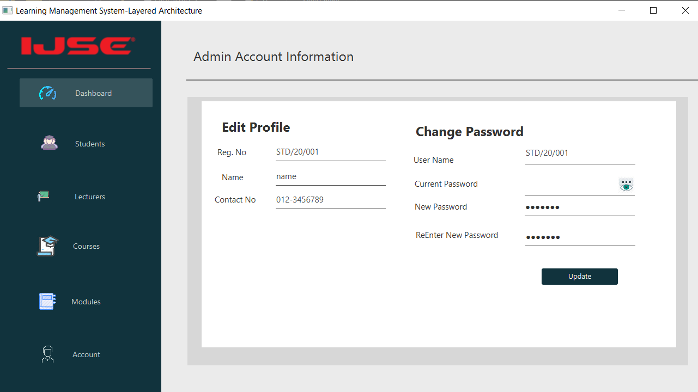

# Learning Management System [Layered Architecture]
> Project represents Learning Management System for the University using Layered Architecture

## Introduction

This application undertakes following functionalities,
        login form    
        Student Registration
        Lecture Registration
        Manage Courses
        Manage Modules
        Manage Announcements
        Manage User Account

## Requirements

Before use this application you must need to install JAVA runtime environment and MYSQL database management services.
links :
    [JAVA](https://www.oracle.com/technetwork/java/javase/downloads/jdk8-downloads-2133151.html) ,
    [MySQL](https://www.mysql.com/)

## Technologies
> JAVA FX | 
> JDBC | 
> Layered Architecture |
> SOLID Design Principals

## Used Design Patterns
> Singleton design pattern |
> Factory design pattern |
> Strategy design pattern |
> Adaptor design pattern |
> Facade design pattern |
> DAO design pattern

## Installation

If you did above installations, You only have to double click the jar file and install the jar file.

## Contributors

name  : Poornima Vithanage | Irushi Salwathura | Amali Sandaruwani | Chinthani Senevirathne
         

e-mail : vithanagepurnima@gmail.com

[Github] (https://github.com/poornimavithanage)

## Login Form

## Dashboard

## Student Registration

## Lecture Registration

## Manage Courses

## Manage Modules

## Manage User Account

## Installation

* jfoenix-8.0.8.jar
* mysql-connector-java-8.0.20.jar

## License

This project is licensed under the MIT License - see the [LICENSE.txt](LICENSE.txt) file for details.

